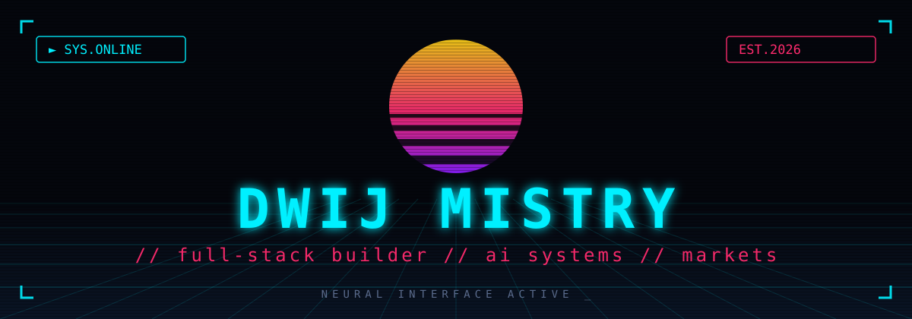

<p align="center">
  
</p>

<p align="center">
  
  
  
</p>

## `> whoami`

```text
name ....... DWIJ MISTRY
role ....... builder of devtools for coding agents
base ....... Gujarat, IN // GTU Computer Engineering
mission .... DDCET 190+ // engineering abroad, 2028
```

I build small, sharp, inspectable tools — the kind that make invisible work
visible. No hype, no black boxes: evidence in, evidence out.

## `> stack`

<p>
  
  
  
  
</p>

## `> arsenal`

| repo | what it does |
| ---- | ------------ |
| [runledger](https://github.com/dwijmistry266-ship-it/runledger) | local-first flight recorder for coding-agent runs |
| [patchproof](https://github.com/dwijmistry266-ship-it/patchproof) | evidence-first pull-request quality reports |
| [ddcet-drill](https://github.com/dwijmistry266-ship-it/ddcet-drill) | terminal practice drills for the DDCET exam |

## `> signal`

<p align="center">
  
  
</p>

## `> uplink`

<p>
  <a href="https://www.instagram.com/dwijjmistry"></a>
</p>

---
<p align="center"><sub>// end of transmission _</sub></p>
